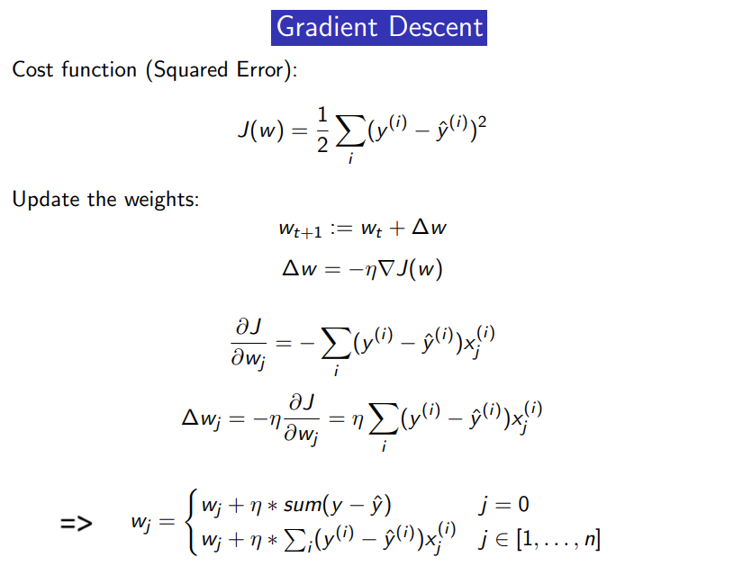
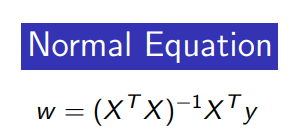

# STUDENT PERFORMANCE PREDICTION
## DATASET : Student_Performance from Kaggle 
## LINEAR REGRESSION FROM SCRATCH

I BUILT A LINEAR REGRESSION MODEL IN 3 WAYS : GRADIENT DESCENT, STOCHASTIC GRADIENT DESCENT, AND NORMAL EQUATION

### GRADIENT DESCENT:

### NORMAL EQUATION:

